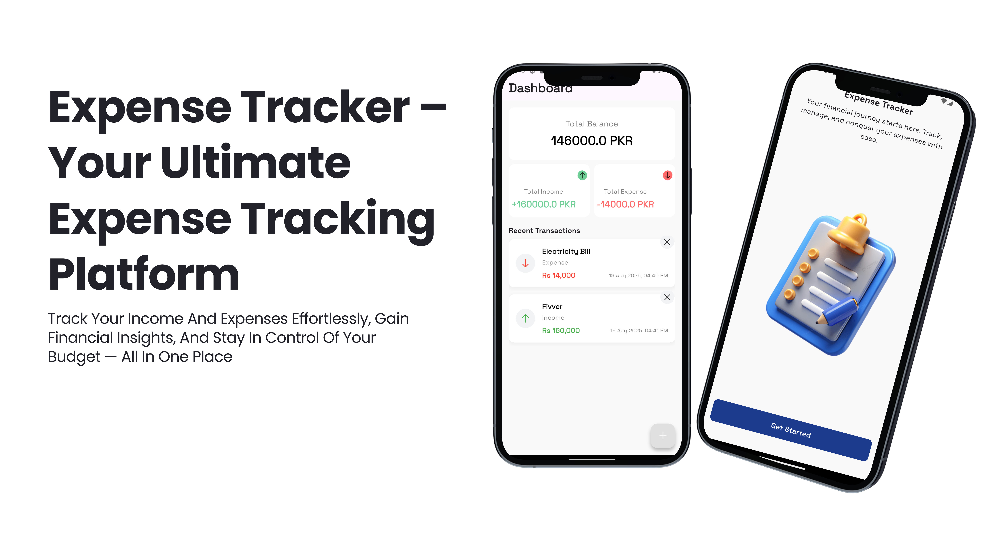

# 📊 Expense Tracker

**SpendSmart – Your Ultimate Expense Tracking Platform**  

Easily track your income and expenses, gain valuable financial insights, and stay in control of your budget — all in one simple app.

---

## 🚀 Getting Started

This project is a starting point for a Flutter application.

A few resources to help you get started with Flutter development:

- [Lab: Write your first Flutter app](https://docs.flutter.dev/get-started/codelab)  
- [Cookbook: Useful Flutter samples](https://docs.flutter.dev/cookbook)  

For help getting started with Flutter development, view the [online documentation](https://docs.flutter.dev/), which offers tutorials, samples, guidance on mobile development, and a full API reference.

---

## 📱 Mockup Preview

Here’s a sneak peek of the app design:

---

## 📌 Features

- Add, edit, and delete transactions  
- Track income vs expenses  
- Get categorized insights  
- Beautiful and simple UI  

---

## 🛠️ Tech Stack

- **Flutter** (Frontend)  
- **Provider** (State Management)  
- **Dart** (Programming Language)  

---

## 🤝 Contributing

Contributions are welcome! Feel free to fork this repo and submit a PR.

---

## 📄 License

This project is licensed under the MIT License.
